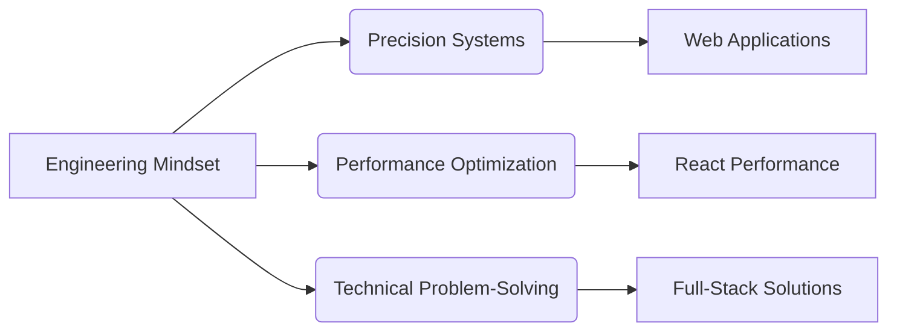
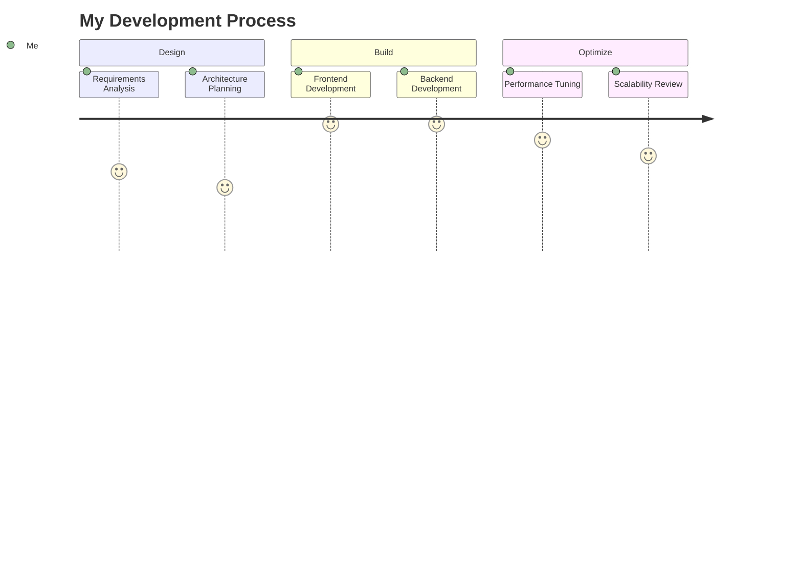
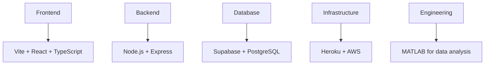

# Hi, I'm Karisa! 👋

### Mechanical Engineer → Full-Stack Developer | Crafting High-Performance Web Solutions

---

---

## 🛠️ Technical Arsenal

### ⚛️ Frontend Mastery

### 🛠️ Backend & Database

### ⚙️ Engineering Toolkit

---

## 🚀 Featured Projects

### 🏠 Full-Stack Property Platform

**Real estate management system with booking engine and admin dashboard**
**Tech:** React (Vite) • Supabase • Tailwind CSS
**Solved:** Complex state management for real-time bookings

### 🛠️ Mechanical CAD Web Viewer

**3D model visualization for engineering components (commissioned)**
**Tech:** Three.js • React • Custom WebGL Shaders
**Solved:** Browser-based rendering of complex CAD models
⭐ **Impact:** Reduced client review cycles by 65%

### 🚲 Bike Collector Analytics

**Inventory management system for bicycle collections**
**Tech:** TypeScript • PostgreSQL • Express.js
**Solved:** Predictive maintenance scheduling algorithm

---

## 🎓 Education & Credentials

**B.Eng Mechanical Engineering**
Shenyang Agricultural University
Thesis: *"Optimization of Mechanical Systems Using Computational Methods"*

---

## 💡 Engineering-Driven Development Philosophy

> *"Applying mechanical precision to digital solutions: I build web applications with the same rigor I'd engineer physical systems. Performance optimization isn't just about faster code — it's about creating efficient, maintainable systems that withstand real-world demands."*

---

## 📈 GitHub Analytics

  
  

  

---

## 🧠 My Development Process

---

## 🔧 My Ideal Stack

> Let's build something powerful together. Feel free to reach out via [email](mailto:karisa@thebikecollector.tech) or check out [voyani.tech](https://voyani.tech).
